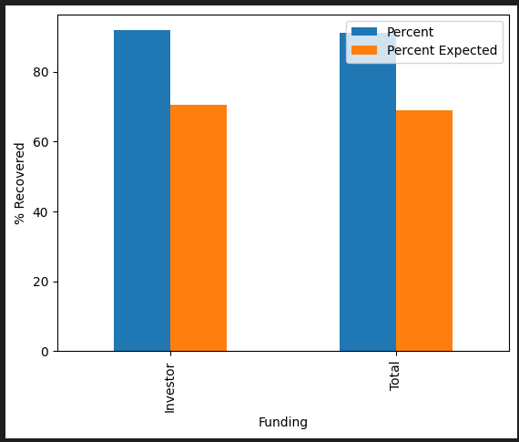
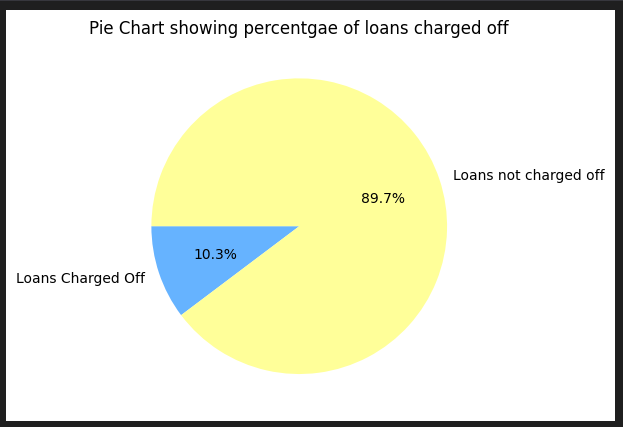
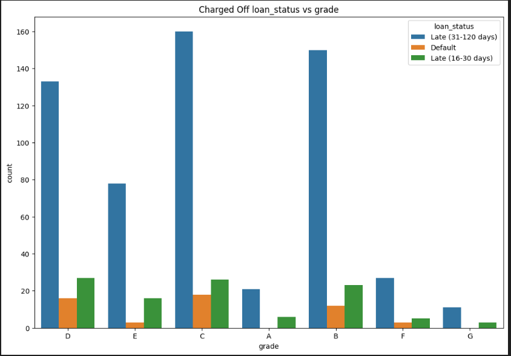
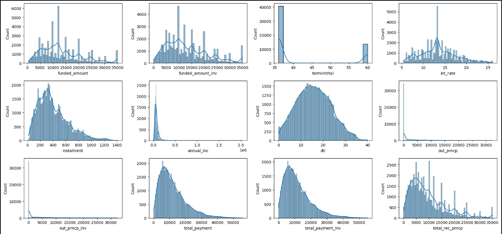
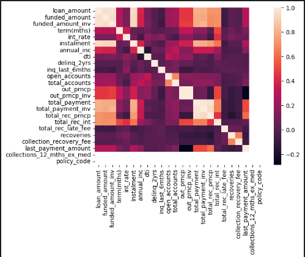

# exploratory-data-analysis---customer-loans-in-finance152
# Exploratory Data Analysis: Customer Loans in Finance
By **balany1**
## Table of Contents:
- [Description](#description)
    - [Key Insights](#key-insights)
- [Installation Instructions](#installation-instructions)
- [Usage Instructions](#usage-instructions)
- [File Structure](#file-structure)
    - [File Description](#understanding-the-files)
- [Project Documentation](#project-documentation)

At minimum, your README file should contain the following information:

## Description

This is a project designed by AiCore to manage and gain insights from a dataset of loan payments. This involved securely downloading the dataset from a PostgreSQL relational database and writing it to a csv file ready to be worked on with Pandas.

Then, the data was converted to a Pandas Dataframe and cleaned by first correcting data types of the columns in the dataset and then imputing any null values/dropping columns with little data. The missingno package was used to determine which columns needed to be dropped and how to impute the missing data. The dataset was further reduced by removing any outliers (I chose to do with a method that looked for z-scores of above 3.5) and dropping any columns that both showed a significant correlation and weren't crucial to the analysis. This was done with seaborn and matlib packages.

A method was also developed to normalise the dataset using seaborn and scipy packages to perform Yeo-Johnson transformations on the dataset.

Analysis was performed on the final dataset giving such example illustrations as below.

Installation instructions
Usage instructions
File structure of the project
License information